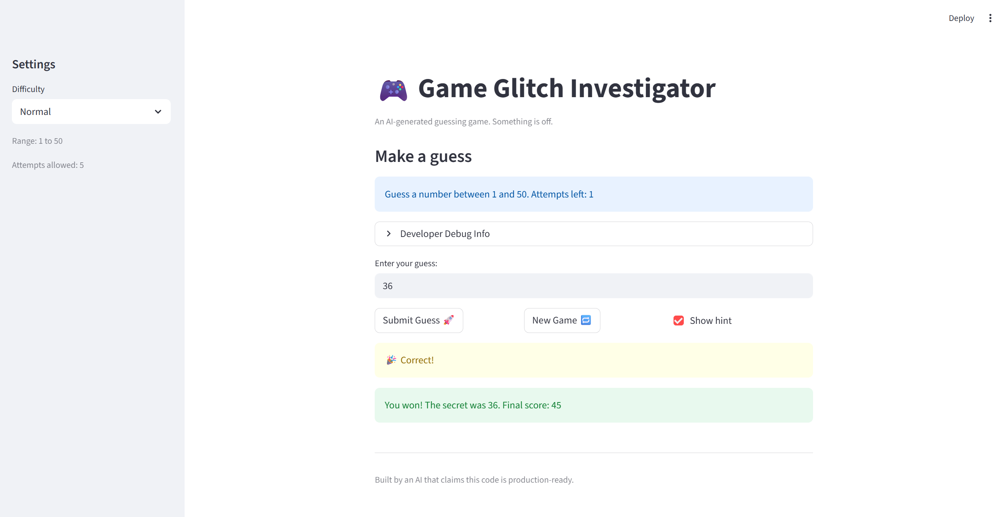

# 🎮 Game Glitch Investigator: The Impossible Guesser

## 🚨 The Situation

You asked an AI to build a simple "Number Guessing Game" using Streamlit.
It wrote the code, ran away, and now the game is unplayable. 

- You can't win.
- The hints lie to you.
- The secret number seems to have commitment issues.

## 🛠️ Setup

1. Install dependencies: `pip install -r requirements.txt`
2. Run the broken app: `python -m streamlit run app.py`

## 🕵️‍♂️ Your Mission

1. **Play the game.** Open the "Developer Debug Info" tab in the app to see the secret number. Try to win.
2. **Find the State Bug.** Why does the secret number change every time you click "Submit"? Ask ChatGPT: *"How do I keep a variable from resetting in Streamlit when I click a button?"*
3. **Fix the Logic.** The hints ("Higher/Lower") are wrong. Fix them.
4. **Refactor & Test.** - Move the logic into `logic_utils.py`.
   - Run `pytest` in your terminal.
   - Keep fixing until all tests pass!

## 📝 Document Your Experience

- [ ] Describe the game's purpose.
   The game's purpose was to guess a random number between a range of three difficulty levels, Easy 1-20, Normal 1-50 and Hard 1-100, in 5 attempts or less, with an updated score.
- [ ] Detail which bugs you found.
   1."Show Hint" shows a glitching "Stop" sign at the top right corner before "Deploy" link for a breif second and disappears. The hints are backwards. "Too High" and "Too Low" are correct but "Go    Higher" and "Go Lower" are backwards.
  2. Attempts Left counter does not work. Display says "1 to 100" regardless of difficulty
  3. Upon ending the game and winning, the game does not reset when "New Game" button is clicked but the details in "Developer Debug Info" changes.
- [ ] Explain what fixes you applied.
   -Bug 1: Fix Hard difficulty range (was easier than Normal)                                                                                                  
   - Bug 2: Swap backwards hint messages (HIGHER/LOWER were reversed)                                                                                             
   - Bug 3: Remove str() cast of secret on even attempts
   - Bug 4: Use dynamic low/high in display instead of hardcoded 1 to 100  
   - Bug 5: New Game now uses difficulty-based range for random secret
   - Bug 6: Fix initial attempts count (was 1, should be 0)
   - Bug 7: Fix inconsistent 'Too High' scoring (even/odd parity issue)
   - Bug 8: Fix win score formula (removed erroneous +1 penalty)
   - Bug 9: Move attempt increment after input validation
   - Bug 10: Rewrite broken test suite with 34 comprehensive tests

## 📸 Demo

- [ ] [Insert a screenshot of your fixed, winning game here]
      

## 🚀 Stretch Features

- [ ] [If you choose to complete Challenge 4, insert a screenshot of your Enhanced Game UI here]
